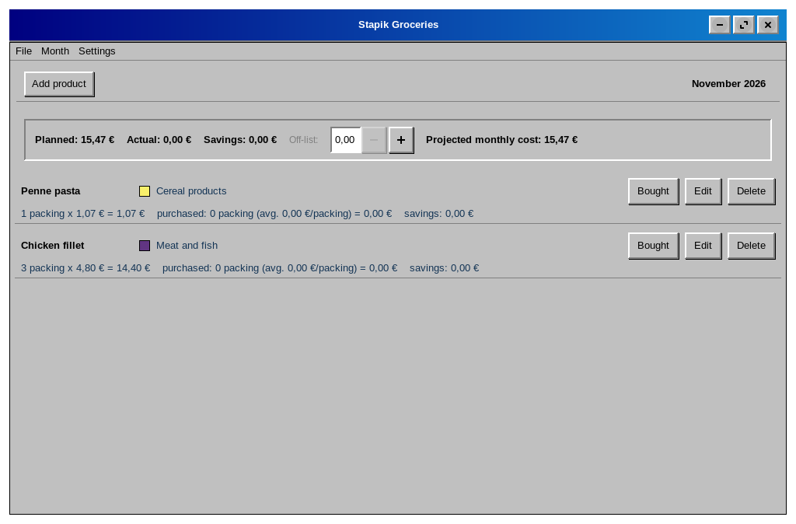
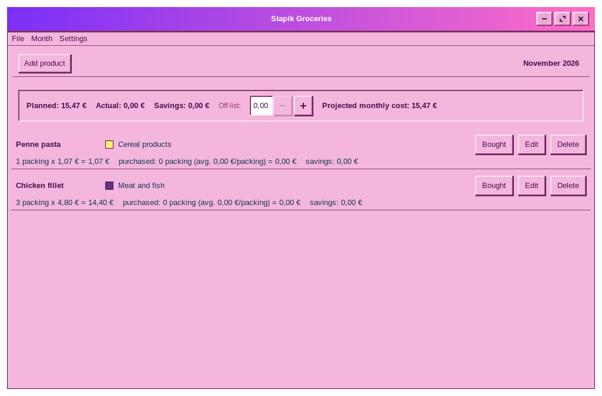
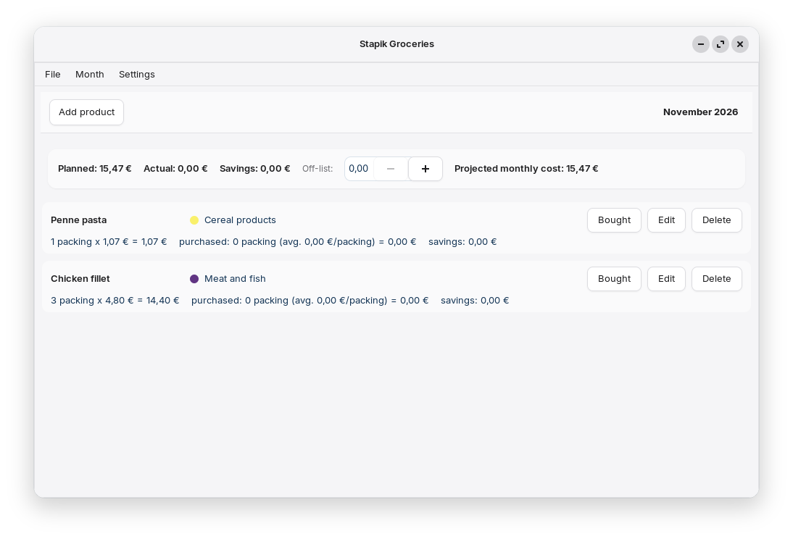

# Stapik Groceries

A desktop grocery-budgeting application for Linux, written in C++20 using GTK4/gtkmm. Plan your monthly shopping list, track what you actually spend versus what you planned, and see your savings — with customizable categories, currencies, languages and themes.



## Features

* **Monthly product list** — plan quantities and unit prices per product, organized by month.
* **Weekly product list** — generate HTML with simple weekly list based on monthly one. 
* **Partial purchase tracking** — record purchases as they happen (e.g. bought 0.5 kg of 2 kg planned), with automatically recalculated average unit price.
* **Planned vs. real spending** — see planned cost, real cost, savings and an off-budget amount (spending outside the list) at a glance.
* **Projected monthly cost** — an estimate of the full month's cost based on prices seen so far.
* **Custom categories** — own categories, each with a customizable color.
* **Month management** — switch between months from the menu, with the current month marked, and delete old months you no longer need.
* **Monthly statistics** — a list view and a bar chart comparing planned, real and savings totals across your last 12 months.
* **Multiple currencies** — choose from a catalog of currencies; the display symbol and format update instantly, with no conversion of existing amounts.
* **Cloud sync** — save and load your shopping data via an external API, compatible with a self-hosted server, with automatic conflict resolution based on timestamps.
* **Multilingual UI** — Polish, English and German interface with instant switching.
* **Auto-save** — data is saved locally after every change.
* **Three themes** — Classic, Modern and Classic Pink, switchable live from the menu.
* **Retro aesthetic** — the Classic theme features an old-school look with raised controls, blue accents and hard-edged windows.

## Dependencies

* `gtkmm-4.0`
* `libcurl`
* [`stapik-common`](https://github.com/Stapik-Group/stapik-common) (fetched automatically via CMake FetchContent)
* `nlohmann/json` (fetched automatically via CMake FetchContent, transitively provided by `stapik-common`)

On Ubuntu/Debian:

```bash
sudo apt install libgtkmm-4.0-dev libcurl4-openssl-dev
```

Building a `.deb` package additionally requires `dpkg-dev` (used to auto-detect runtime dependencies):

```bash
sudo apt install dpkg-dev
```

## Building

```bash
git clone https://github.com/Stapik-Group/stapik-groceries
cd stapik-groceries
cmake -B cmake-build-release -DCMAKE_BUILD_TYPE=Release
cmake --build cmake-build-release
```

## Installation

### Option 1 — Download prebuilt `.deb` (recommended)

Download the latest `.deb` package from the [Releases page](https://github.com/Stapik-Group/stapik-groceries/releases), then install it:

```bash
sudo dpkg -i stapikgroceries_*.deb
sudo apt install -f   # resolves any missing runtime dependencies
```

### Option 2 — Build `.deb` from source

If you'd rather build the package yourself:

```bash
cd cmake-build-release
cpack -G DEB
sudo dpkg -i stapikgroceries_*.deb
sudo apt install -f
```

Either option installs the app to `/usr/lib/stapikgroceries/`, with a launcher at `/usr/bin/stapikgroceries`, and it appears in the desktop environment's application menu.

### Option 3 — Per-user install (no sudo required)

```bash
cmake --install cmake-build-release --prefix "$HOME/.local"
```

Installs to `~/.local/lib/stapikgroceries/`, with a launcher at `~/.local/bin/stapikgroceries`. Make sure `~/.local/bin` is in your `PATH`.

## Uninstalling

### If installed via `.deb`

```bash
sudo dpkg -r stapikgroceries
```

### If installed per-user

```bash
rm -rf ~/.local/lib/stapikgroceries
rm ~/.local/bin/stapikgroceries
rm ~/.local/share/applications/stapikgroceries.desktop
rm ~/.local/share/icons/hicolor/256x256/apps/stapikgroceries.png
```

Uninstalling the application does not remove your shopping data, cloud configuration, language or theme preference stored in `~/.local/share/stapikgroceries/`.

## Cloud Sync

The app supports synchronization via [Stapik Cloud](https://github.com/Stapik-Group/stapik-cloud). Go to **File → Connect to cloud**, enter the server URL and API key. If a connection is already configured, the app reconnects automatically on startup.

Once connected, the app compares the local document and the cloud copy using a `lastUpdate` timestamp and keeps whichever one is newer, overwriting the other **as a whole document**. There is no field-level or entry-level merging — if both copies changed since the last sync, the older document is fully replaced.

Data is saved locally after every change, and the app also attempts to push it to the cloud immediately. Changes to the selected currency are treated as document changes and are synchronized as well.

Writes use optimistic concurrency checking: if another device saved a newer version in the meantime, the write is rejected, the server's copy is fetched, and the app retries once against that version before falling back to accepting the server's version. If the cloud is unreachable, the change remains saved locally and will be retried on the next save. You can also trigger synchronization manually from **File → Sync**.

**Caution for multi-device use:** because conflict resolution operates on the whole document, editing your list offline on two different machines before either one reconnects can cause one set of changes to be discarded. Stapik Cloud keeps a version history of every write, so a discarded document is not permanently lost, but the application does not currently expose a way to browse or restore previous versions. If you use the app on multiple devices, synchronize regularly to avoid overwriting your own changes.

The app communicates with the Stapik Cloud `/documents/{slotKey}` endpoint using an `x-api-key` header. Make sure the server URL has no trailing slash — a trailing slash produces a doubled `/` in the request path, which some servers will silently treat as "no document yet" instead of an error.

## Data Storage

Grocery data is stored locally at:

```text
~/.local/share/stapikgroceries/groceries.json
```

The document contains the categories, monthly product lists, currency code and `lastUpdate` timestamp used for cloud synchronization.

Other application data is stored at:

```text
~/.local/share/stapikgroceries/config.json
~/.local/share/stapikgroceries/locale.txt
~/.local/share/stapikgroceries/theme.txt
```

Cloud configuration, language and theme preferences are kept separately from the synchronized document.

## Themes

Switch between three themes from **Settings → Theme**:

* **Classic** — the original retro look with raised controls, blue accents and hard-edged windows.
* **Modern** — a clean, flat and minimal appearance.
* **Classic Pink** — the retro aesthetic with a pink color palette.

The theme applies instantly and is remembered between launches.




## TODO

* [x] Monthly product list with planned quantities and prices
* [x] Partial purchase tracking with average unit price
* [x] Planned / real / savings / off-budget summary
* [x] Custom categories with colors
* [x] Month switching and deletion
* [x] Monthly statistics — list and chart view
* [x] Multiple currencies
* [x] Multilingual UI
* [x] Cloud sync with conflict resolution
* [x] Auto-save
* [x] `.deb` package for easier distribution
* [x] Multiple themes (Classic / Modern / Classic Pink)
* [ ] Import a shopping list from CSV
* [ ] Flatpak package